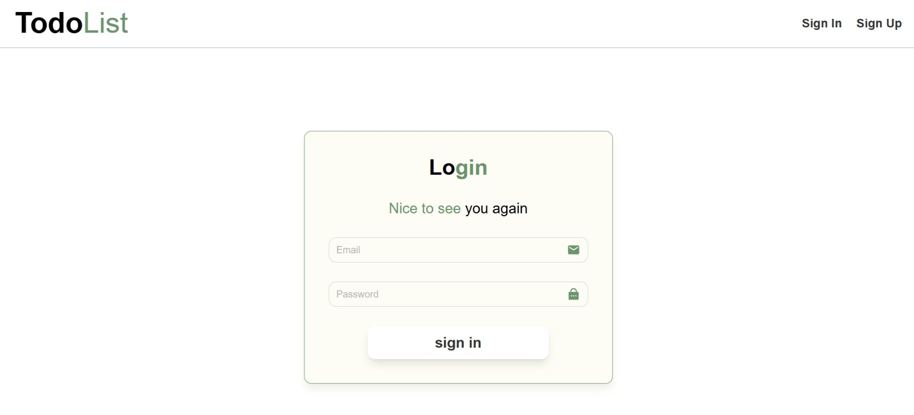
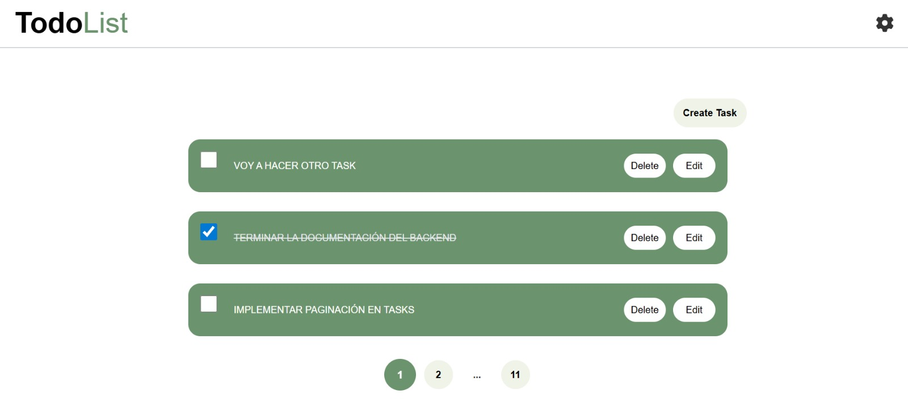
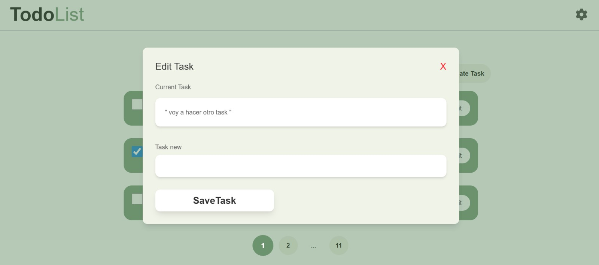
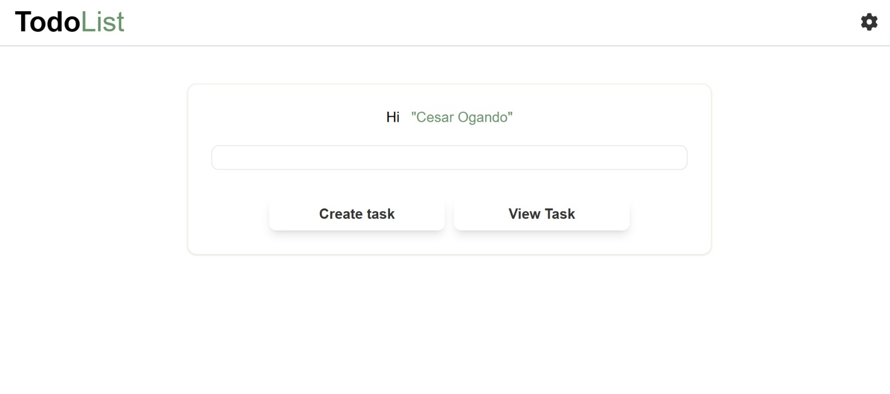
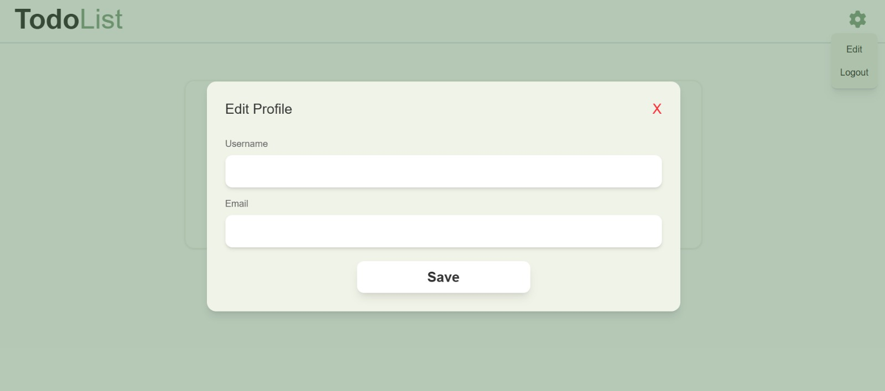

# TodoList (React + TypeScript + Vite)

Responsive task manager with authentication, full CRUD for tasks, pagination, and profile editing.

## Screenshots
Images live in `src/assets/docs-screenshots/`. Previewed below at a smaller width to keep focus on the content:

<p align="center">
  
  
  
  
  
</p>

## Features
- Sign in / sign up with clear error messages and success feedback.
- Task CRUD: create, list, complete, edit, delete.
- Compact pagination with ellipsis for long lists.
- Profile edit (username/email).
- Fully responsive layout for mobile, tablet, and desktop.

## Tech Stack
- React 19 + TypeScript
- Vite
- Tailwind (v4 config)
- react-hook-form
- react-router-dom
- ESLint

## Requirements
- Node 18+ and npm.
- Backend running at `http://localhost:4000/api` with endpoints `user/login`, `user/register`, `user/logout`, and task CRUD (see `src/services/api.ts`).

## Setup
```bash
npm install
npm run dev       # dev server
npm run build     # production build
npm run preview   # serve built files
npm run lint      # lint code
```

## API Configuration
`src/services/api.ts` uses `Base_URL = http://localhost:4000/api` and `credentials: "include"` for cookies. Update this URL or move it to env vars if your backend differs.

## Key Structure
- `src/pages/` - main screens (SignIn, SignUp, TaskCreate, TaskList, DashBoard, etc.).
- `src/components/` - layout, buttons, modals, shared UI.
- `src/services/` - API integrations (auth, tasks).
- `src/context/` - global auth/task state.
- `src/assets/docs-screenshots/` - README screenshots.

## Notes
- Forms surface backend validation errors and show success messages on registration.
- UI containers and controls adapt by breakpoint to preserve readability and spacing on small screens.
